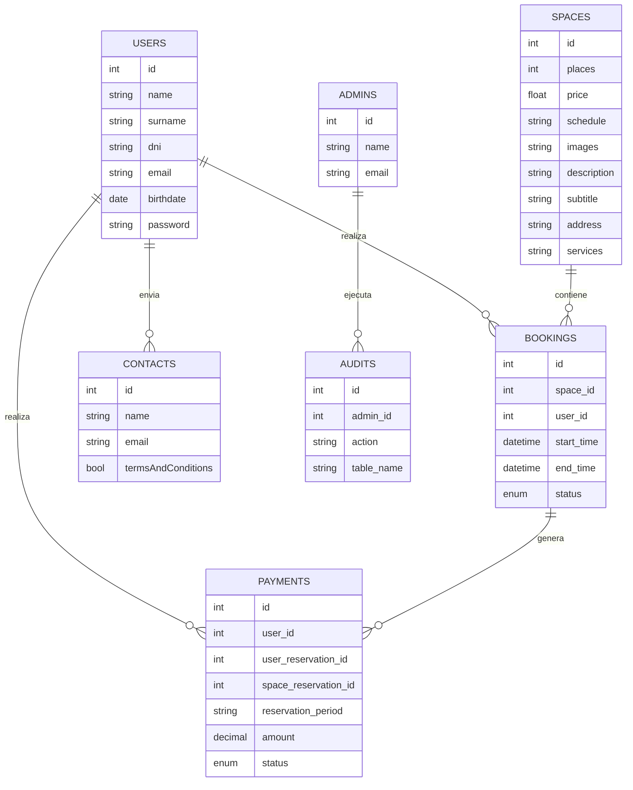

# Memoria Técnica: Green Work Page

## 1. Introducción al problema

GreenWork es una empresa local dedicada al alquiler de espacios de trabajo colaborativo (coworking) que, debido a su rápido crecimiento, ha comenzado a enfrentar graves problemas de gestión derivados de la administración manual de reservas, usuarios, pagos y comunicaciones (por email y hojas de cálculo). Entre los principales problemas detectados se encuentran:

- Duplicidad de reservas.
- Pérdida de información relevante.
- Clientes insatisfechos por la falta de confirmación rápida.
- Excesivo tiempo invertido en tareas administrativas.

Esta situación afecta tanto a la satisfacción de los clientes como a la eficiencia operativa de la empresa.

## 2. Objetivos del proyecto

El objetivo principal es desarrollar una aplicación web funcional que automatice y digitalice la gestión de GreenWork, resolviendo los problemas de organización y mejorando la experiencia de sus clientes. Los objetivos específicos son:

- Eliminar la duplicidad de reservas y la pérdida de información.
- Mejorar la satisfacción del cliente mediante confirmaciones automáticas y gestión ágil.
- Reducir el tiempo dedicado a tareas administrativas.
- Permitir a los clientes registrarse, iniciar sesión y reservar espacios de forma autónoma.
- Evitar conflictos de horario con reservas simultáneas.
- Proveer un panel de administración básico para la gestión de reservas y usuarios.
- Cumplir con las guías de diseño profesional y la normativa GDPR.
- Ofrecer una interfaz responsive y fácil de usar.
- Incluir al menos una funcionalidad extra (por ejemplo, confirmación automática o notificación simulada).

## 3. Funcionalidades implementadas

### Funcionalidades principales
- Registro y autenticación de usuarios y administradores.
- Búsqueda y filtrado de espacios disponibles.
- Visualización de detalles, características y servicios de cada espacio.
- Reserva de espacios con control de solapamiento de horarios.
- Gestión de pagos y comprobantes.
- Panel de administración para gestión de usuarios, espacios, reservas y auditorías.
- Sistema de contacto y soporte.

## 4. Estructura del sistema

El sistema está compuesto por dos aplicaciones principales:

- **Backend (Laravel + PostgreSQL):** expone una API RESTful para la gestión de usuarios, espacios, reservas y auditorías. Implementa autenticación, validación, control de acceso y lógica de negocio.
- **Frontend (React + Vite):** interfaz de usuario moderna, responsive y multilingüe, que consume la API y permite la interacción con todas las funcionalidades.

**Estructura de carpetas:**
- `/api`: Backend Laravel
  - `/app/Models/`: Modelos de datos (User, Space, Booking, etc.)
  - `/app/Http/Controllers/`: Controladores de la API (gestión de reservas, usuarios...)
  - `/database/migrations/`: Migraciones de la base de datos (estructura de tablas)
  - `/database/seeders/`: Carga de datos iniciales
  - `/routes/api.php`: Definición de rutas de la API
  - `/config/`: Archivos de configuración (base de datos, mail, servicios...)
  - `/public/`: Punto de entrada de la aplicación y recursos públicos
  - `/storage/`: Archivos subidos y logs

- `/frontend`: Frontend React
  - `/src/components/`: Componentes reutilizables de la interfaz (formularios, listas, cards...)
  - `/src/pages/`: Páginas principales de la aplicación (Home, Login, Espacios, Reservas...)
  - `/src/services/`: Servicios para la conexión con la API (peticiones HTTP)
  - `/src/assets/`: Imágenes, iconos y recursos estáticos
  - `/src/locales/`: Archivos de internacionalización (traducciones)
  - `/public/`: Archivos estáticos públicos y punto de entrada del frontend
  - `/index.html`: Archivo base del frontend

Esta organización permite separar claramente la lógica de negocio, la gestión de datos y la presentación, facilitando el mantenimiento y la escalabilidad del sistema.

## 5. Esquema de la base de datos

El modelo relacional principal es el siguiente:

## 6. Riesgos específicos del puesto de trabajo

- **Riesgos de seguridad informática:** acceso no autorizado, fuga de datos, ataques de fuerza bruta.
- **Riesgos de disponibilidad:** caídas del servidor, pérdida de datos por fallos en backups.
- **Riesgos de integridad:** errores en la validación de reservas, solapamiento de horarios.
- **Riesgos legales:** incumplimiento de la RGPD en el tratamiento de datos personales.

## 7. Conclusiones y mejoras posibles

Green Work Page cumple con los objetivos planteados, ofreciendo una plataforma robusta y segura para la gestión de espacios de coworking sostenibles. Entre las posibles mejoras destacan:
- Integración de pasarelas de pago adicionales.
- Implementación de notificaciones en tiempo real.
- Mejora de la experiencia de usuario en dispositivos móviles.
- Automatización avanzada de auditorías y reportes.
- Expansión internacional y soporte para más idiomas.
