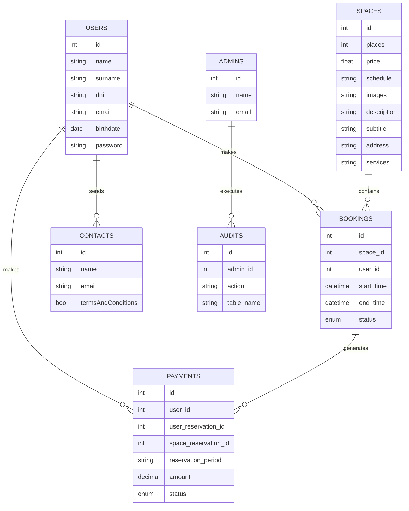

# Technical Report: Green Work Page

## 1. Introduction to the Problem

GreenWork is a local company dedicated to renting coworking spaces. Due to its rapid growth, it has begun to face serious management issues stemming from the manual administration of bookings, users, payments, and communications (via email and spreadsheets). The main problems identified include:

- Duplicate bookings.
- Loss of relevant information.
- Unsatisfied clients due to lack of quick confirmation.
- Excessive time spent on administrative tasks.

This situation affects both customer satisfaction and the operational efficiency of the company.

## 2. Project Objectives

The main objective is to develop a functional web application that automates and digitizes GreenWork's management, solving organizational problems and improving the customer experience. The specific objectives are:

- Eliminate duplicate bookings and information loss.
- Improve customer satisfaction through automatic confirmations and agile management.
- Reduce time spent on administrative tasks.
- Allow clients to register, log in, and book spaces independently.
- Prevent scheduling conflicts with simultaneous bookings.
- Provide a basic admin panel for managing bookings and users.
- Comply with professional design guidelines and GDPR regulations.
- Offer a responsive and user-friendly interface.
- Include at least one extra feature (e.g., automatic confirmation or simulated notification).

## 3. Implemented Features

### Main Features
- User and admin registration and authentication.
- Search and filtering of available spaces.
- Viewing details, features, and services of each space.
- Space booking with overlap control.
- Payment management and receipts.
- Admin panel for managing users, spaces, bookings, and audits.
- Contact and support system.

## 4. System Structure

The system consists of two main applications:

- **Backend (Laravel + PostgreSQL):** exposes a RESTful API for managing users, spaces, bookings, and audits. Implements authentication, validation, access control, and business logic.
- **Frontend (React + Vite):** modern, responsive, and multilingual user interface that consumes the API and enables interaction with all functionalities.

**Folder Structure:**
- `/api`: Laravel Backend
    - `/app/Models/`: Data models (User, Space, Booking, etc.)
    - `/app/Http/Controllers/`: API controllers (booking management, users, etc.)
    - `/database/migrations/`: Database migrations (table structure)
    - `/database/seeders/`: Initial data loading
    - `/routes/api.php`: API route definitions
    - `/config/`: Configuration files (database, mail, services, etc.)
    - `/public/`: Application entry point and public resources
    - `/storage/`: Uploaded files and logs

- `/frontend`: React Frontend
    - `/src/components/`: Reusable UI components (forms, lists, cards, etc.)
    - `/src/pages/`: Main application pages (Home, Login, Spaces, Bookings, etc.)
    - `/src/services/`: Services for API connection (HTTP requests)
    - `/src/assets/`: Images, icons, and static resources
    - `/src/locales/`: Internationalization files (translations)
    - `/public/`: Public static files and frontend entry point
    - `/index.html`: Base frontend file

This organization clearly separates business logic, data management, and presentation, facilitating system maintenance and scalability.

## 5. Database Schema

The main relational model is as follows:

## 6. Specific Job Risks

- **IT security risks:** unauthorized access, data leaks, brute force attacks.
- **Availability risks:** server downtime, data loss due to backup failures.
- **Integrity risks:** errors in booking validation, schedule overlaps.
- **Legal risks:** non-compliance with GDPR in personal data processing.

## 7. Conclusions and Possible Improvements

Green Work Page meets the stated objectives, offering a robust and secure platform for managing sustainable coworking spaces. Possible improvements include:
- Integration of additional payment gateways.
- Implementation of real-time notifications.
- Improved user experience on mobile devices.
- Advanced automation of audits and reports.
- International expansion and support for more languages.
